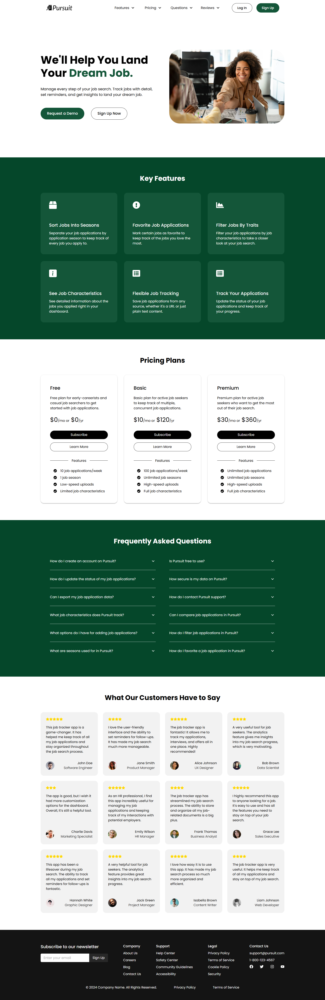

Web scraping & AI-powered detailed/flexible job application tracker featuring automatic job data extraction, organization of jobs by application season, job application status tracking, and job data filtering/sorting. Built using Next.js, Auth.js, MaterialUI, Django, ScraperAPI, OpenAI API, and PostgreSQL. Deployed using Render and Vercel.

The application follows a client-server architecture with a Next.js frontend communicating with a Django REST API backend. The backend stores user data, job entries, and season data in PostgreSQL, and integrates external APIs including ScraperAPI for web scraping and OpenAI API for intelligent job data extraction and parsing.

**Pages:**
- `pages/index.tsx`: Landing page displaying app features, pricing, FAQ, and reviews with authentication redirect to dashboard.
- `pages/dashboard.tsx`: Main dashboard displaying job application tracker with season-based organization, job filtering/sorting, and job management features.
- `pages/api/auth/[...nextauth].js`: NextAuth.js authentication configuration handling user login, registration, and session management with JWT tokens.

**API Routes:**
- `POST /api/login/`: User authentication endpoint.
- `POST /api/google/`: Google OAuth login endpoint.
- `POST /api/token/refresh/`: Refresh JWT access token.
- `GET /api/user/`: Retrieve authenticated user details.
- `GET /api/users/profile/`: Retrieve user profile details.
- `GET /api/seasons/`: Retrieve all seasons for authenticated user.
- `POST /api/seasons/add/`: Create new application season.
- `POST /api/jobs/`: Retrieve all jobs for a user within a specific season.
- `POST /api/jobs/add/`: Create new job entry from URL with automatic web scraping and AI extraction.
- `POST /api/jobs/add/text/`: Create new job entry from text input with AI extraction.
- `POST /api/jobs/update/`: Update existing job entry.
- `POST /api/jobs/delete/`: Delete job entry.
- `POST /api/jobs/export/`: Export jobs to CSV format.

  
  
  
  

