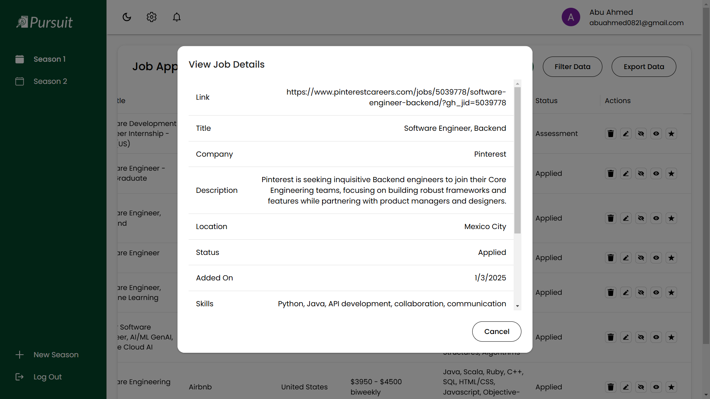
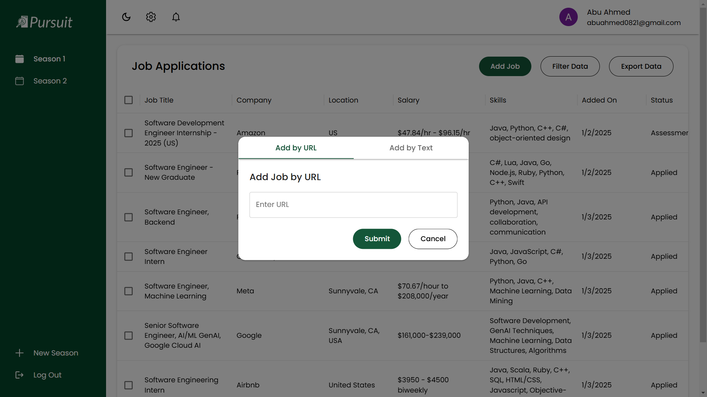

Web scraping & AI-powered detailed/flexible job application tracker featuring automatic job data extraction, organization of jobs by application season, job application status tracking, and job data filtering/sorting. Built using Next.js, Auth.js, MaterialUI, Django, ScraperAPI, OpenAI API, and PostgreSQL. Deployed using Render and Vercel.

